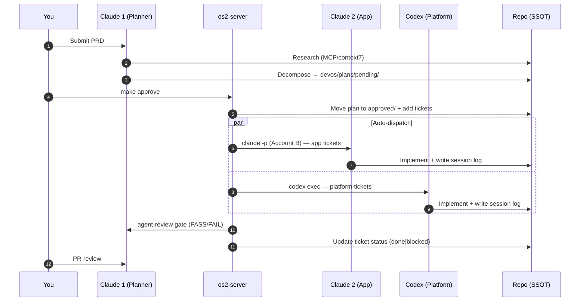
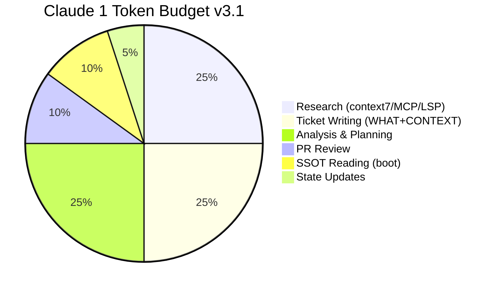

# Vibe Coding OS v3.1 (Claude x Claude x Codex)

A repo-first operating system for **multi-agent parallel coding** that keeps you in flow.

- **Claude 1** → *Planner + Researcher* (plan → research → tickets → review — NO implementation code)
- **Claude 2** → *App Builder* (backend logic + GUI design/impl, Account B)
- **Codex** → *Platform Builder* (infra, data, tests, scripts, mechanical changes)

> **Principle:** Chat is not the source of truth. **The repo is.**

---

## Why this exists

Multi-agent coding usually fails for boring reasons:
- Claude runs out of tokens doing everything alone
- Context drifts across chats
- Multiple agents edit overlapping files
- Questions interrupt work and kill momentum

Vibe Coding OS solves this:
**planner/builder separation + repo-based truth + queued decisions + ownership + approval workflow**.

---

## What's new in v3.1

| Change | v2.0 | v3.1 |
|--------|------|------|
| Agents | Claude + Codex + Gemini | Claude 1 + Claude 2 + Codex |
| Frontend builder | Gemini CLI | Claude 2 (Account B, design judgment) |
| Dispatch | Manual (`codex` / `gemini`) | Automated (`make dispatch-all`) |
| Approval | None | PRD → plan → `make approve` → auto-dispatch |
| Gate pipeline | None | tests → secrets → agent-review → verify |
| Gate failure | Ticket blocked | Auto-retry with file rollback |
| Auto-chain | None | Downstream tickets auto-dispatch on completion |
| Config | Makefile only | `os2.yaml` (agents, gates, retry policy) |
| Claude 2 auth | N/A | Account B via `CLAUDE_CONFIG_DIR=.claude-b` |

---

## Repo layout

```
repo/
  AGENTS.md                  # Codex CLI native instruction file (auto-loaded)
  os2.yaml                   # Master config (agents, gates, dispatch settings)
  .claude/
    CLAUDE.md                # Claude 1 operating rules (auto-loaded)
    hooks/guard-no-impl.sh   # Blocks Claude 1 from writing impl code
    settings.json            # Hook + MCP server config
  .claude-b/
    CLAUDE.md                # Claude 2 operating rules (Account B)
  Makefile                   # Primary CLI interface
  requirements.txt           # pyyaml>=6.0
  scripts/setup.sh           # First-time setup script
  com.os2.server.plist       # macOS launchd config (sub-machine auto-start)

  server/                    # os2-server (Python dispatcher)
    dispatcher.py            # Multi-agent dispatch + gate pipeline
    ssot.py                  # SSOT file readers/writers
    approval.py              # Plan approval state machine
    planner.py               # claude -p pipe mode wrapper
    config.py                # os2.yaml loader

  devos/                     # SSOT Brain
    AI.md                    # Shared agent constitution
    CONTEXT.md               # TL;DR (update each session)
    PROJECT_STATE.md         # Current state
    TASKS.md                 # Human task board view
    agents/registry.yaml     # 3-agent registry with scopes
    tasks/QUEUE.yaml         # Ticket queue (machine-readable)
    plans/                   # Approval workflow (pending/approved/rejected)
    logs/                    # Session logs (cross-agent visibility)
    questions/QUEUE.md       # Async question queue (A-Mode)
    docs/                    # Contracts, ADR, architecture, guides
```

---

## Quickstart

### 1. Use GitHub template
Go to this repo on GitHub → **Use this template** → Create your project repo.

### 2. Clone and install
```bash
git clone <your-repo-url>
cd <your-repo-folder>
make setup          # first-time setup (CLI checks + venv + Claude 2 auth)
```

### 3. Start the server
```bash
make start
```

### 4. Open Claude 1 (Account A)
```bash
# Claude Code CLI — auto-reads .claude/CLAUDE.md
claude
```

### 5. First commit
```bash
git add .
git commit -m "chore: bootstrap vibe coding OS v3.1"
git push -u origin main
```

---

## Daily workflow

```bash
make pickup         # (multi-machine) git pull + start
```

Then:

1. **Claude 1 planning** — open Claude Code in this repo
Claude auto-reads `.claude/CLAUDE.md` and reads SSOT files.
Submit a PRD → Claude 1 decomposes it into tickets → saves a plan.

2. **Approve the plan**
```bash
make pending        # review the plan
make approve        # approve → tickets added → auto-dispatch begins
# or:
make reject R="reason"  # reject → Claude 1 revises
```

3. **Builders work in parallel** (auto-dispatched by os2-server)
```
Claude 2 (Account B) → app tickets (backend + GUI)
Codex                → platform tickets (infra, tests, scripts)
```

4. **Check status**
```bash
make status         # project status
make queue          # ticket queue
make logs           # recent session logs
```

5. **Before handoff**
```bash
make handoff        # stop + git push (switch to another machine)
```

---

## How it works

### Swimlane workflow



### Token budget (why Claude 1 doesn't code)



---

## WHAT+CONTEXT ticket design

Claude 1 writes **WHAT** (behavioral requirements) and **CONTEXT** (research findings).
Builders decide **HOW** (implementation approach, code structure, patterns).

```yaml
- id: T-123
  owner: CLAUDE2
  status: todo
  priority: high
  goal: "What to build — behavioral requirement"
  context: |
    Why it's needed + Claude 1's research findings
    (MCP/context7: latest API changes, version constraints)
  constraints:
    - "Technical constraint (versions, compatibility)"
  dod:
    - "POST /endpoint with valid input returns 200 + expected response"
    - "POST /endpoint with invalid input returns 400 + error message"
  files:
    - "apps/api/src/feature.ts"
  verify: "make pr-check"
  deps: []
```

---

## Gate pipeline

After each agent completes, the dispatcher runs:

```
1. make test          — test suite
2. make scan-secrets  — secret scanning
3. agent-review       — Claude 1 reviews diff against DOD (PASS/FAIL verdict)
4. ticket verify      — ticket-specific verify command
```

On gate failure: files are rolled back and the agent retries automatically.
Retry count is priority-based (critical: 3, high: 2, medium/low: 1).

---

## Auto-chain dispatch

When a ticket completes:
- The dispatcher re-scans the queue for newly unblocked tickets
- Downstream tickets (deps satisfied) are dispatched automatically
- No manual `make dispatch-all` needed between tickets

---

## Session logs

Builders write structured logs to `devos/logs/` at session end.
Claude 1 reads them at next boot for cross-agent context.

```bash
make logs          # list recent logs
```

---

## Agent registry

All agents registered in `devos/agents/registry.yaml`:
- `claude1-planner` — Planner + Researcher (Account A)
- `claude2-app` — App Builder (Account B, backend + GUI design)
- `codex-platform` — Platform Builder (infra, tests, scripts, mechanical)

---

## A-Mode (queued decisions)

**Rule:** don't stop building to ask. Queue it.

Add to `devos/questions/QUEUE.md` with Options + Recommendation + Default.
Resolve at session start via Claude 1 triage.

---

## Ownership & collision rules

- **1 ticket = 1 PR**
- Each ticket has strict `files:` scope
- Builders edit **only** files in their scope
- **Contract-first**: update docs before code
- Scope conflicts detected before dispatch (no parallel edits to the same file)

---

## Multi-machine setup (optional)

Run os2-server as a daemon on a sub-machine for always-on control:

```bash
# Edit com.os2.server.plist — update WorkingDirectory to your project path
make install-daemon   # register launchd (sub-machine)
make uninstall-daemon # unregister
```

```bash
make handoff          # main machine → stop + push
make pickup           # sub machine → pull + start
```

---

## FAQ

### Do I need two Claude accounts?
No. If `.claude-b` credentials are not configured, CLAUDE2 tickets automatically fall back to CODEX.

### Do I need all three agents?
No. The OS works with just Codex. Claude 2 (Account B) is additive — it adds design judgment for GUI-heavy tasks.

### Why can't Claude 1 write code?
Each agent has limited tokens. If Claude 1 spends tokens writing code, it can't plan.
Delegation = more total output.

### What is Claude 1's Researcher role?
Claude 1 has MCP/context7/LSP tools that builders lack. Claude 1 uses them to research
latest library APIs and version constraints, then includes findings in ticket `context:`.
This bridges the tool asymmetry between Claude 1 and the builders.

### What is the session log for?
Builders write a structured log (≤50 lines) at session end. Claude 1 reads these logs
at boot to understand what was built, what decisions were made, and what's pending.
No more context blindness between agents.

### What does `make approve` do?
Moves the plan from `devos/plans/pending/` to `approved/`, writes tickets to `QUEUE.yaml`,
and auto-dispatches all `todo` tickets to their assigned agents.

---

## Contributing
See `CONTRIBUTING.md`.
If you fork/adapt, keep SSOT under `devos/` and keep the workflow simple.
